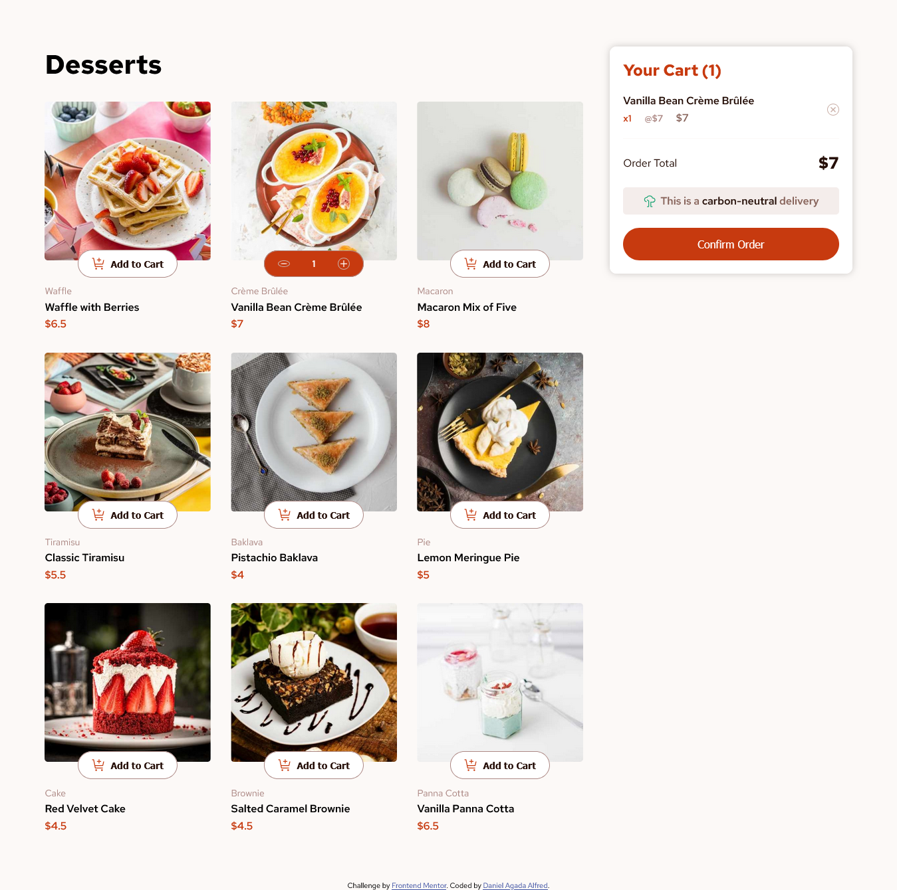

# Frontend Mentor - Product list with cart solution

This is a solution to the [Product list with cart challenge on Frontend Mentor](https://www.frontendmentor.io/challenges/product-list-with-cart-5MmqLVAp_d). Frontend Mentor challenges help you improve your coding skills by building realistic projects.

## Table of contents

- [Overview](#overview)
  - [The challenge](#the-challenge)
  - [Screenshot](#screenshot)
  - [Links](#links)
- [My process](#my-process)
  - [Built with](#built-with)
  - [What I learned](#what-i-learned)
- [Author](#author)
- [Acknowledgments](#acknowledgments)

## Overview

### The challenge

Users should be able to:

- Add items to the cart and remove them
- Increase/decrease the number of items in the cart
- See an order confirmation modal when they click "Confirm Order"
- Reset their selections when they click "Start New Order"
- View the optimal layout for the interface depending on their device's screen size
- See hover and focus states for all interactive elements on the page

### Screenshot

### Links

- Solution URL: [Add solution URL here](https://your-solution-url.com)
- Live Site URL: [dessertpurchase.netlify.app](https://dessertpurchase.netlify.app/)

## My process

### Built with

- Semantic HTML5 markup
- CSS custom properties
- Flexbox
- Desktop-first workflow
- Vanilla JavaScript

### What I learned

This project thought me a number of things:

- Linking font with the stylesheet when the font is in a different folder
- Experience in refactoring code for reuseability
- Making decisions with optimization & efficiency in mind
- Using media query for responsiveness
- My problem-solving ability improved
- I became more proficient in manipulating the DOM

## Author

- Website - [Daniel Agada Alfred]()
- Frontend Mentor - [@CodyDani](https://www.frontendmentor.io/profile/CodyDani)
- Twitter - [@CodeDanie](https://x.com/CodeDanie)

## Acknowledgments

My gratitude goes to my mentor, Mr. Michael, who led me into doing this challenge. I wouldn't have gotten to the end without his Challenge.
